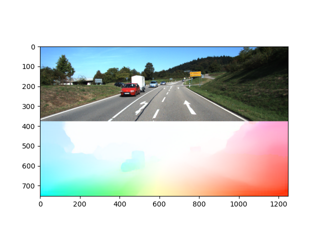
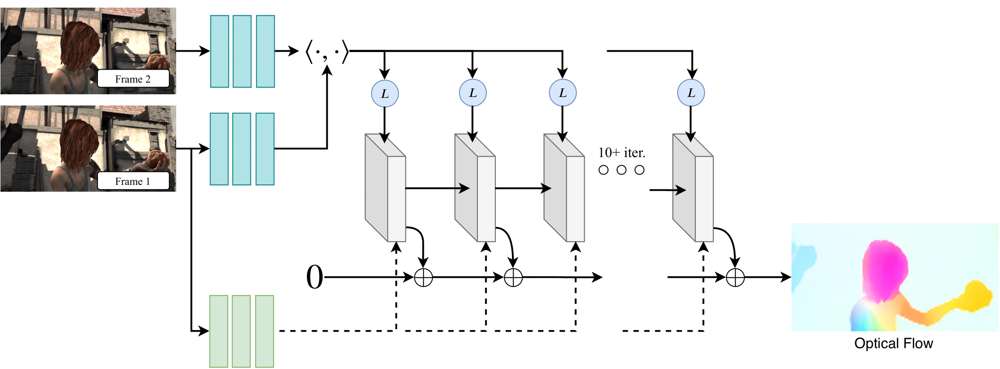

# RAFT Recurrent All Pairs Field Transforms for Optical Flow

Optical flow is the task of estimating per-pixel motion between video frames. It is a long-standing vision problem that remains unsolved. The best systems are limited by difficulties including fast-moving objects, occlusions, motion blur, and textureless surfaces.

RecurrentAll-PairsFieldTransforms(RAFT), a new deep network architecture for optical flow. RAFT extracts per- pixel features, builds multi-scale 4D correlation volumes for all pairs of pixels, and iteratively updates a flow field through a recurrent unit that performs lookups on the correlation volumes.
## Results
---
Validation Result (EPE) after 25000 steps:


|Validation     | EPE            |
|---------------|----------------|
|`clean`        | 1.862296       |
|`final`        | **2.564600**   |


Sample from Sintel         |  Moving Cars              |  Cars captured from Moving Car        
:-------------------------:|:-------------------------:|:-----------------------------------:
   |     |  

Full Movement              |  Hand Movement              
:-------------------------:|:-------------------------:
      |     

## Architecture
---
[RAFT: Recurrent All Pairs Field Transforms for Optical Flow](https://arxiv.org/pdf/2003.12039.pdf)<br/>
ECCV 2020 <br/>
Authors : Zachary Teed and Jia Deng<br/>


Fig. : RAFT consists of 3 main components: (1) A feature encoder that extracts per-pixel features from both input images, along with a context encoder that extracts features from only I1. (2) A correlation layer which constructs a 4D W × H × W × H correlation volume by taking the inner product of all pairs of feature vectors. The last 2-dimensions of the 4D volume are pooled at multiple scales to construct a set of multi-scale volumes. (3) An update operator which recurrently updates optical flow by using the current estimate to look up values from the set of correlation volumes.
<br>
<br>

## Requirements
---
The code has been tested with PyTorch 1.6 and Cuda 10.1.
```Shell
conda create --name raft
conda activate raft
conda install pytorch=1.6.0 torchvision=0.7.0 cudatoolkit=10.1 matplotlib tensorboard scipy opencv -c pytorch
```

## Demos
---
We have stored our model under checkpoints and it can be used for demo using:
```Shell
python3 demo.py --model=checkpoints/model-name --path=path-for-evaluation-dataset --mixed_precision
```

## Required Data
---
To evaluate/train RAFT, you will need to download the required datasets. 

* [Sintel](http://sintel.is.tue.mpg.de/)

Or use this Sintel dataset download link:
```
wget http://files.is.tue.mpg.de/sintel/MPI-Sintel-complete.zip
```

By default `datasets.py` will search for the datasets in these locations. You can create symbolic links to wherever the datasets were downloaded in the `datasets` folder

```Shell
├── datasets
    ├── Sintel
        ├── test
        ├── training
```

## Evaluation
---
You can evaluate a trained model using `evaluate.py`
```Shell
python3 evaluate.py --model=models/raft-things.pth --dataset=sintel --mixed_precision
```

## Training
We trained our model on RTX GPU using:
```Shell
python3 -u train.py --name raft-sintel --stage sintel --validation sintel --gpus 0 --num_steps 25000 --batch_size 5 --lr 0.0001 --image_size 368 768 --wdecay 0.00001 --gamma=0.85 --mixed_precision
```
